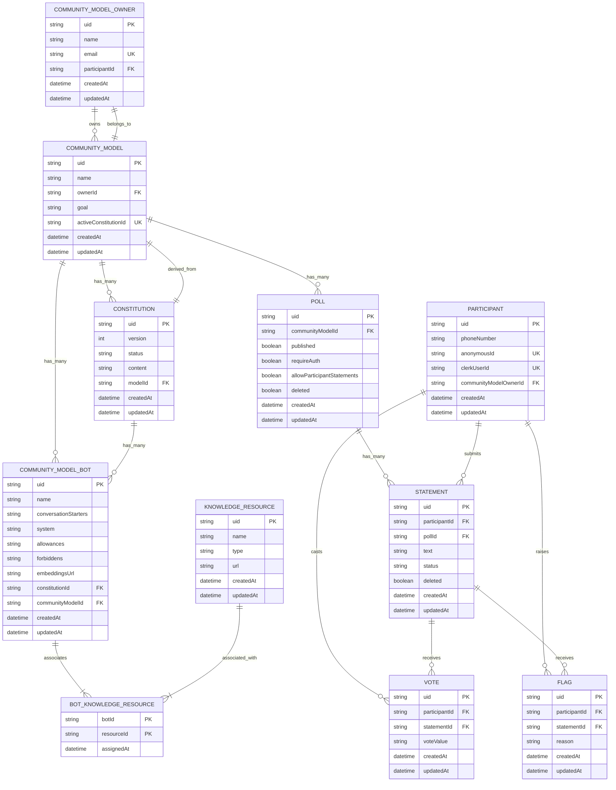

```mermaid
erDiagram
    %% Entities (Models)
    COMMUNITY_MODEL_OWNER {
        string uid PK
        string name
        string email UK
        string participantId FK
        datetime createdAt
        datetime updatedAt
    }

    COMMUNITY_MODEL {
        string uid PK
        string name
        string ownerId FK
        string goal
        string activeConstitutionId UK
        datetime createdAt
        datetime updatedAt
    }

    CONSTITUTION {
        string uid PK
        int version
        string status
        string content
        string modelId FK
        datetime createdAt
        datetime updatedAt
    }

    POLL {
        string uid PK
        string communityModelId FK
        boolean published
        boolean requireAuth
        boolean allowParticipantStatements
        boolean deleted
        datetime createdAt
        datetime updatedAt
    }

    PARTICIPANT {
        string uid PK
        string phoneNumber
        string anonymousId UK
        string clerkUserId UK
        string communityModelOwnerId FK
        datetime createdAt
        datetime updatedAt
    }

    STATEMENT {
        string uid PK
        string participantId FK
        string pollId FK
        string text
        string status
        boolean deleted
        datetime createdAt
        datetime updatedAt
    }

    VOTE {
        string uid PK
        string participantId FK
        string statementId FK
        string voteValue
        datetime createdAt
        datetime updatedAt
    }

    FLAG {
        string uid PK
        string participantId FK
        string statementId FK
        string reason
        datetime createdAt
        datetime updatedAt
    }

    KNOWLEDGE_RESOURCE {
        string uid PK
        string name
        string type
        string url
        datetime createdAt
        datetime updatedAt
    }

    COMMUNITY_MODEL_BOT {
        string uid PK
        string name
        string conversationStarters
        string system
        string allowances
        string forbiddens
        string embeddingsUrl
        string constitutionId FK
        string communityModelId FK
        datetime createdAt
        datetime updatedAt
    }

    BOT_KNOWLEDGE_RESOURCE {
        string botId PK
        string resourceId PK
        datetime assignedAt
    }

    %% Relationships
    COMMUNITY_MODEL_OWNER ||--o{ COMMUNITY_MODEL : owns
    COMMUNITY_MODEL ||--|| COMMUNITY_MODEL_OWNER : belongs_to
    COMMUNITY_MODEL ||--o{ CONSTITUTION : has_many
    COMMUNITY_MODEL ||--o{ POLL : has_many
    COMMUNITY_MODEL ||--o{ COMMUNITY_MODEL_BOT : has_many
    CONSTITUTION ||--|| COMMUNITY_MODEL : derived_from
    CONSTITUTION ||--o{ COMMUNITY_MODEL_BOT : has_many
    POLL ||--o{ STATEMENT : has_many
    PARTICIPANT ||--o{ STATEMENT : submits
    PARTICIPANT ||--o{ VOTE : casts
    PARTICIPANT ||--o{ FLAG : raises
    STATEMENT ||--o{ VOTE : receives
    STATEMENT ||--o{ FLAG : receives
    COMMUNITY_MODEL_BOT ||--|{ BOT_KNOWLEDGE_RESOURCE : associates
    KNOWLEDGE_RESOURCE ||--|{ BOT_KNOWLEDGE_RESOURCE : associated_with
```